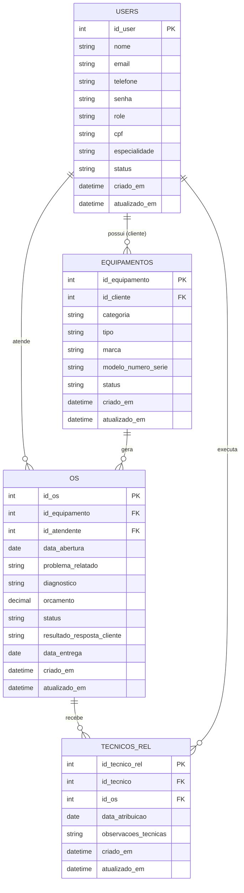

# DER Simplificado

Modelo de dados atual do sistema: 4 tabelas, sem controle de estoque. Substitui o modelo anterior (`PIM - Modelagem Banco de Dados.brM3`), que tinha 10 entidades - 4 delas só para separar Admin/Técnico/Recepcionista/Cliente como tabelas próprias via relação "SE".

## Por que 4 tabelas

- **`users` única:** Administrador, Recepcionista, Técnico e Cliente são a mesma entidade - o que muda é o campo `role`. A especificidade do técnico (especialidade) fica no mesmo registro, em vez de uma tabela `Tecnico` separada.
- **Ativar/inativar em vez de excluir:** `users.status` e `equipamentos.status` (`ativo` \| `inativo`) substituem a exclusão física de registros (RN12) — um funcionário que sai ou um equipamento fora de uso é inativado, preservando o histórico das OS relacionadas.
- **Sem estoque:** peças e estoque saíram do escopo do sistema. Não existe `Item_OS` nem `Estoque`.
- **Um ou mais técnicos por OS:** `tecnicos_rel` é uma tabela associativa - uma OS pode ter 0, 1 ou vários técnicos, cada um em sua própria linha.
- **Sem trava rígida de papel nas chaves estrangeiras:** `os.id_atendente` e `tecnicos_rel.id_tecnico` apontam para `users.id_user` de forma genérica. Na ausência de um Recepcionista ou Técnico cadastrado, o Administrador ocupa o mesmo campo - a regra fica na RN11 do `requisitos.md`, não na estrutura da tabela.
- **Hardware e software na mesma tabela:** `equipamentos.categoria` (`hardware` \| `software`) evita criar uma tabela separada só para licenças de software — o registro de uma licença usa os mesmos campos que o de um equipamento físico.
- **Unicidade e consistência do `status`:** `email`/`cpf` únicos (RN13) e a trava entre `status` inativo e OS em andamento (RN14) evitam login duplicado e inconsistências como inativar um técnico no meio de um reparo.
- **Chaves nomeadas por tabela (`id_<tabela>`):** toda chave primária e estrangeira segue o padrão `id_user`, `id_equipamento`, `id_os`, `id_tecnico_rel` — nunca um `id` genérico. Deixa claro, só pelo nome da coluna, de qual tabela ela veio.
- **Colunas de rastreio em todas as tabelas:** `criado_em` e `atualizado_em` registram quando o registro foi criado/alterado pela última vez — útil para auditoria e para os relatórios/indicadores (RF10), sem depender de olhar o histórico de OS.

## Diagrama

## Campos por tabela

| Tabela | Campo | Observação |
|---|---|---|
| `users` | `id_user` | Chave primária. |
| | `nome` | Comum a todos os perfis. |
| | `senha` | Armazenada como hash, nunca em texto plano (RNF10). |
| | `email` | Usado como login de acesso (RF01) — único por usuário (RN13). |
| | `telefone` | Contato do cliente/equipe; usado para notificação (RF09). |
| | `role` | `admin` \| `recepcionista` \| `tecnico` \| `cliente`. |
| | `cpf` | Usado quando `role = cliente` — único por cliente (RN13). |
| | `especialidade` | Usado quando `role = tecnico`. |
| | `status` | `ativo` \| `inativo` — para qualquer perfil (RN12). Login de usuário inativo é bloqueado; não pode ser vinculado a nova OS nem inativado com OS em andamento (RN14). |
| | `criado_em`, `atualizado_em` | Data/hora de criação e última alteração do cadastro. |
| `equipamentos` | `id_equipamento` | Chave primária. |
| | `id_cliente` | Chave estrangeira para `users.id_user` (role cliente). |
| | `categoria` | `hardware` \| `software` — deixa explícito que o item pode ser um equipamento físico ou uma licença/programa. |
| | `tipo`, `marca` | Ex.: hardware → "Notebook", "Dell"; software → "Sistema Operacional", "Microsoft". |
| | `modelo_numero_serie` | Modelo/número de série (hardware) ou chave de licença (software). |
| | `status` | `ativo` \| `inativo` (RN12) — não pode ser vinculado a nova OS nem inativado com OS em andamento (RN14). |
| | `criado_em`, `atualizado_em` | Data/hora de criação e última alteração do cadastro. |
| `os` | `id_os` | Chave primária. |
| | `id_equipamento` | Chave estrangeira para `equipamentos.id_equipamento` (RN02). |
| | `id_atendente` | Chave estrangeira para `users.id_user` - normalmente recepcionista; admin cobre a ausência (RN11). |
| | `status` | Ciclo da OS (Aberta, Em análise, ..., Finalizada, Cancelada) — não confundir com o `status` ativo/inativo de `users`/`equipamentos`. |
| | `data_abertura`, `problema_relatado`, `diagnostico`, `orcamento`, `resultado_resposta_cliente`, `data_entrega` | Acompanham a OS do início ao fim do fluxo (datas de negócio, informadas pelo atendente/técnico). |
| | `criado_em`, `atualizado_em` | Data/hora técnica de criação e última alteração do registro — diferente de `data_abertura`/`data_entrega`, que são preenchidas pelo usuário. |
| `tecnicos_rel` | `id_tecnico_rel` | Chave primária. |
| | `id_tecnico` | Chave estrangeira para `users.id_user` (role técnico; admin cobre a ausência, RN11). |
| | `id_os` | Chave estrangeira para `os.id_os`. Uma OS pode ter várias linhas aqui - um ou mais técnicos. |
| | `data_atribuicao`, `observacoes_tecnicas` | - |
| | `criado_em`, `atualizado_em` | Data/hora de criação e última alteração do registro de atribuição. |

## Exemplo - OS com dois técnicos

| id_tecnico_rel | id_os | id_tecnico | observacoes_tecnicas |
|---|---|---|---|
| 1 | 42 | 7 (Técnico A) | Verificou a fonte de alimentação. |
| 2 | 42 | 9 (Técnico B) | Trocou a placa-mãe. |

## Em aberto

- "Resultado/Respostas" ficou como colunas dentro de `os` (`diagnostico`, `resultado_resposta_cliente`) em vez de tabela própria.
- `Centro de Custos` não faz parte deste modelo - fica fora do escopo, a menos que a equipe decida incluir depois.
