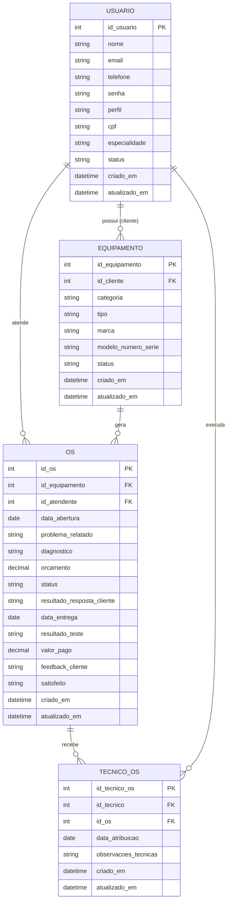

# DER Simplificado

Modelo de dados do sistema: 4 tabelas, sem controle de estoque. Substitui o modelo anterior (`PIM - Modelagem Banco de Dados.brM3`), com 10 entidades, das quais 4 destinadas apenas a separar Admin/Técnico/Recepcionista/Cliente como tabelas próprias por meio de relação "SE".

Nomenclatura no padrão singular e em português. Cada tabela representa uma entidade - um registro corresponde a uma instância, não a uma coleção: `usuario`, `equipamento`, `os`, `tecnico_os`.

## Por que 4 tabelas

- **`usuario` única:** Administrador, Recepcionista, Técnico e Cliente são a mesma entidade; o que os diferencia é o campo `perfil`. A especificidade do técnico (especialidade) fica no mesmo registro, sem uma tabela `Tecnico` separada.
- **Ativação/inativação em vez de exclusão:** `usuario.status` e `equipamento.status` (`ativo` \| `inativo`) substituem a exclusão física de registros (RN12). Um funcionário desligado ou um equipamento fora de uso é inativado, preservando o histórico das ordens de serviço relacionadas.
- **Sem estoque:** peças e estoque não fazem parte do escopo do sistema. Não existem as tabelas `item_os` nem `estoque`.
- **Um ou mais técnicos por OS:** `tecnico_os` é uma tabela associativa. Uma ordem de serviço pode ter 0, 1 ou vários técnicos, cada um em sua própria linha.
- **Chaves estrangeiras simples, sem coluna redundante:** `os.id_atendente`, `tecnico_os.id_tecnico` e `equipamento.id_cliente` são chaves estrangeiras simples para `usuario.id_usuario`. O perfil correspondente a cada uma (RN15, RN16) é reforçado por trigger, sem coluna adicional dedicada à restrição - ver seção seguinte.
- **Hardware e software na mesma tabela:** `equipamento.categoria` (`hardware` \| `software`) evita uma tabela separada para licenças de software; o registro de uma licença usa os mesmos campos de um equipamento físico.
- **Unicidade e consistência de status:** `email`/`cpf` únicos (RN13) e a restrição entre `status` inativo e ordem de serviço em andamento (RN14) evitam login duplicado e inconsistências como a inativação de um técnico durante um reparo.
- **Chaves nomeadas por tabela (`id_<tabela>`):** toda chave primária e estrangeira segue o padrão `id_usuario`, `id_equipamento`, `id_os`, `id_tecnico_os`, nunca um `id` genérico - a origem de cada coluna é identificável pelo próprio nome.
- **Colunas de rastreio em todas as tabelas:** `criado_em` e `atualizado_em` registram a data de criação e da última alteração de cada registro, para fins de auditoria e de relatórios/indicadores (RF10).

## Integridade de papel: `tecnico_os` e `equipamento`

Uma chave estrangeira simples (`tecnico_os.id_tecnico -> usuario.id_usuario`, `equipamento.id_cliente -> usuario.id_usuario`) garante apenas que o `id_usuario` referenciado existe, não que esse usuário tem o `perfil` esperado. Sem reforço adicional, um erro de código ou uma atualização indevida poderia associar em `tecnico_os` o id de um Recepcionista, ou vincular um `equipamento` ao id de um Técnico em vez de um Cliente, sem que o banco rejeitasse o registro.

Essa restrição pode ser reforçada em SQL de duas formas: por chave estrangeira composta contra uma coluna redundante que armazena cópia do `perfil` esperado, ou por trigger. O sistema usa triggers, sem coluna redundante: nem `tecnico_os` nem `equipamento` recebem uma coluna adicional apenas para viabilizar a restrição.

```sql
-- RN15: tecnico_os.id_tecnico so pode referenciar um usuario com perfil
-- tecnico ou admin (admin cobre a ausencia de tecnico, RN11). Cobre INSERT
-- e UPDATE.
CREATE TRIGGER trg_tecnico_os_valida_perfil_ins
BEFORE INSERT ON tecnico_os
FOR EACH ROW
WHEN (SELECT perfil FROM usuario WHERE id_usuario = NEW.id_tecnico) NOT IN ('tecnico', 'admin')
BEGIN
    SELECT RAISE(ABORT, 'id_tecnico deve referenciar um usuario com perfil tecnico ou admin');
END;

CREATE TRIGGER trg_tecnico_os_valida_perfil_upd
BEFORE UPDATE OF id_tecnico ON tecnico_os
FOR EACH ROW
WHEN (SELECT perfil FROM usuario WHERE id_usuario = NEW.id_tecnico) NOT IN ('tecnico', 'admin')
BEGIN
    SELECT RAISE(ABORT, 'id_tecnico deve referenciar um usuario com perfil tecnico ou admin');
END;

-- RN16: equipamento.id_cliente so pode referenciar um usuario com perfil
-- cliente.
CREATE TRIGGER trg_equipamento_valida_cliente_ins
BEFORE INSERT ON equipamento
FOR EACH ROW
WHEN (SELECT perfil FROM usuario WHERE id_usuario = NEW.id_cliente) <> 'cliente'
BEGIN
    SELECT RAISE(ABORT, 'id_cliente deve referenciar um usuario com perfil cliente');
END;

CREATE TRIGGER trg_equipamento_valida_cliente_upd
BEFORE UPDATE OF id_cliente ON equipamento
FOR EACH ROW
WHEN (SELECT perfil FROM usuario WHERE id_usuario = NEW.id_cliente) <> 'cliente'
BEGIN
    SELECT RAISE(ABORT, 'id_cliente deve referenciar um usuario com perfil cliente');
END;
```

Sintaxe em SQLite. A lógica equivalente para MySQL/MariaDB e SQL Server está em `schema_mysql.sql`/`schema_sqlserver.sql`; apenas a sintaxe de trigger varia entre motores, ao contrário de uma chave estrangeira ou `CHECK` comuns.

### Alternativa não adotada: chave estrangeira composta

A alternativa a um trigger é uma chave estrangeira composta: uma coluna redundante na tabela filha (por exemplo, `perfil_tecnico`), com a chave estrangeira simples substituída por uma composta apontando para duas colunas de `usuario` ao mesmo tempo (`FOREIGN KEY (id_tecnico, perfil_tecnico) REFERENCES usuario (id_usuario, perfil)`). A abordagem é inteiramente declarativa, mas acrescenta a cada tabela protegida uma coluna sem uso para o negócio, existente apenas para viabilizar a restrição - por isso não foi adotada.

| Critério | Trigger (adotado) | Chave estrangeira composta |
|---|---|---|
| Local da regra | Código procedural no banco | Estrutura da tabela (`CREATE TABLE`) |
| Coluna adicional | Não | Sim - cópia do `perfil`, sem uso pelo negócio |
| Mensagem de erro | Customizável, referencia a RN diretamente | Genérica do motor ("FOREIGN KEY constraint failed") |
| Cobertura de UPDATE | Sim, com o trigger de `UPDATE` correspondente | Sim, automaticamente |
| Portabilidade | Sintaxe de trigger varia entre SGBDs (três versões: SQLite, MySQL, SQL Server) | SQL padrão, sem alteração entre SGBDs |

### Alteração de perfil após vínculo existente

O sistema não possui uma operação dedicada de alteração de perfil, mas RF02 permite "alterar" um usuário sem excluir o campo `perfil` dessa operação. Os quatro triggers anteriores não cobrem esse caso isoladamente: cada um reage a alterações na própria tabela (`id_tecnico` em `tecnico_os`, `id_cliente` em `equipamento`), não a uma alteração de `usuario.perfil`. Um técnico cujo perfil muda para `admin` permanece válido (RN11 já admite `admin`); um técnico cujo perfil mudasse para `recepcionista` deixaria linhas de `tecnico_os` inconsistentes sem que o banco identificasse o problema.

Um quinto trigger, em `usuario`, verifica as duas tabelas dependentes do perfil antes de aceitar a alteração:

```sql
CREATE TRIGGER trg_usuario_valida_troca_perfil
BEFORE UPDATE OF perfil ON usuario
FOR EACH ROW
WHEN (
        EXISTS (SELECT 1 FROM tecnico_os WHERE id_tecnico = NEW.id_usuario)
        AND NEW.perfil NOT IN ('tecnico', 'admin')
    )
    OR (
        EXISTS (SELECT 1 FROM equipamento WHERE id_cliente = NEW.id_usuario)
        AND NEW.perfil <> 'cliente'
    )
BEGIN
    SELECT RAISE(ABORT, 'novo perfil e incompativel com vinculos existentes em tecnico_os ou equipamento');
END;
```

Se o `id_usuario` está referenciado em `tecnico_os.id_tecnico`, o novo perfil deve permanecer em `('tecnico', 'admin')`; se está referenciado em `equipamento.id_cliente`, deve permanecer `'cliente'`. A alteração é rejeitada quando qualquer uma das duas condições é violada. Validado nos três motores: a alteração de perfil de um técnico com atribuição ativa é rejeitada; a alteração para `admin` (RN11) é aceita; a alteração de perfil de um usuário sem vínculo existente é aceita.

## Integridade de status: vínculos com usuário/equipamento inativo (RN14)

RN14 é reforçada por dois pares de triggers.

O primeiro impede a vinculação de um registro inativo a uma nova ordem de serviço: ao abrir uma OS (`INSERT INTO os`), o equipamento, o cliente proprietário do equipamento e o atendente devem estar com `status = 'ativo'`; ao atribuir um técnico (`INSERT INTO tecnico_os`), o técnico também deve estar ativo.

```sql
CREATE TRIGGER trg_os_valida_ativos_ins
BEFORE INSERT ON os
FOR EACH ROW
WHEN (SELECT status FROM equipamento WHERE id_equipamento = NEW.id_equipamento) <> 'ativo'
    OR (SELECT status FROM usuario WHERE id_usuario = (
            SELECT id_cliente FROM equipamento WHERE id_equipamento = NEW.id_equipamento
        )) <> 'ativo'
    OR (SELECT status FROM usuario WHERE id_usuario = NEW.id_atendente) <> 'ativo'
BEGIN
    SELECT RAISE(ABORT, 'equipamento, cliente e atendente devem estar ativos para abrir uma OS (RN14)');
END;
```

O segundo impede a inativação de um registro com ordem de serviço em andamento: antes de aceitar `UPDATE ... SET status = 'inativo'` em `usuario` ou `equipamento`, o trigger verifica a existência de uma `os` com status `aberta` ou `em_andamento` associada ao registro - como atendente, como técnico (via `tecnico_os`) ou como cliente (via `equipamento`) - e rejeita a inativação quando encontra alguma.

```sql
CREATE TRIGGER trg_usuario_valida_inativacao
BEFORE UPDATE OF status ON usuario
FOR EACH ROW
WHEN NEW.status = 'inativo' AND OLD.status = 'ativo' AND (
    EXISTS (SELECT 1 FROM os WHERE id_atendente = NEW.id_usuario AND status IN ('aberta', 'em_andamento'))
    OR EXISTS (
        SELECT 1 FROM tecnico_os t JOIN os o ON o.id_os = t.id_os
        WHERE t.id_tecnico = NEW.id_usuario AND o.status IN ('aberta', 'em_andamento')
    )
    OR EXISTS (
        SELECT 1 FROM equipamento e JOIN os o ON o.id_equipamento = e.id_equipamento
        WHERE e.id_cliente = NEW.id_usuario AND o.status IN ('aberta', 'em_andamento')
    )
)
BEGIN
    SELECT RAISE(ABORT, 'usuario nao pode ser inativado com ordem de servico em andamento (RN14)');
END;
```

A versão para `equipamento` segue a mesma lógica, restrita a `os.id_equipamento`. Script completo, com as quatro versões traduzidas para MySQL/MariaDB e SQL Server, em `schema.sql`/`schema_mysql.sql`/`schema_sqlserver.sql`. Validado nos três motores: a abertura de OS para cliente inativo é rejeitada; a inativação de atendente ou equipamento com OS aberta é rejeitada; a finalização da OS libera a inativação.

## Diagrama



## Campos por tabela

| Tabela | Campo | Observação |
|---|---|---|
| `usuario` | `id_usuario` | Chave primária. |
| | `nome` | Comum a todos os perfis. |
| | `senha` | Armazenada como hash, nunca em texto plano (RNF10). |
| | `email` | Login de acesso (RF01); único por usuário (RN13). |
| | `telefone` | Contato do cliente ou da equipe; usado na notificação de entrega (RF09). |
| | `perfil` | `admin` \| `recepcionista` \| `tecnico` \| `cliente`. |
| | `cpf` | Preenchido quando `perfil = cliente`; único por cliente (RN13). |
| | `especialidade` | Preenchido quando `perfil = tecnico`. |
| | `status` | `ativo` \| `inativo`, válido para qualquer perfil (RN12). Usuário inativo não pode autenticar-se, ser vinculado a nova OS, nem ter uma OS em andamento no momento da inativação (RN14). |
| | `criado_em`, `atualizado_em` | Data e hora de criação e da última alteração do cadastro. |
| `equipamento` | `id_equipamento` | Chave primária. |
| | `id_cliente` | Chave estrangeira simples para `usuario.id_usuario`; trigger garante `perfil = cliente` (RN16, ver "Integridade de papel"). |
| | `categoria` | `hardware` \| `software`, distinguindo equipamento físico de licença/programa. |
| | `tipo`, `marca` | Exemplo: hardware -> "Notebook"/"Dell"; software -> "Sistema Operacional"/"Microsoft". |
| | `modelo_numero_serie` | Modelo/número de série (hardware) ou chave de licença (software). |
| | `status` | `ativo` \| `inativo` (RN12); não pode ser vinculado a nova OS nem inativado com OS em andamento (RN14). |
| | `criado_em`, `atualizado_em` | Data e hora de criação e da última alteração do cadastro. |
| `os` | `id_os` | Chave primária. |
| | `id_equipamento` | Chave estrangeira para `equipamento.id_equipamento` (RN02). |
| | `id_atendente` | Chave estrangeira para `usuario.id_usuario`, normalmente um Recepcionista; o Administrador substitui na ausência (RN11). Sem trigger de papel: essa substituição é comportamento previsto, não uma inconsistência a ser bloqueada. |
| | `status` | Ciclo da OS, com 4 estados: `aberta` \| `em_andamento` \| `finalizada` \| `cancelada`; distinto do `status` ativo/inativo de `usuario`/`equipamento`. As etapas intermediárias (diagnóstico realizado, orçamento enviado, aprovação recebida) são deriváveis do preenchimento de `diagnostico`/`orcamento`/`resultado_resposta_cliente`, sem exigir um estado próprio para cada uma. "Arquivada" (RN09) não é um estado à parte: é o nome de negócio para uma OS `cancelada` - toda OS cancelada já fica preservada no histórico, seja por decisão administrativa (UC27) ou por recusa do orçamento renegociado (UC41). |
| | `data_abertura`, `problema_relatado`, `diagnostico`, `orcamento`, `resultado_resposta_cliente`, `data_entrega` | Acompanham a OS da abertura à entrega; datas de negócio, preenchidas pelo atendente ou pelo técnico. |
| | `resultado_teste` | `aprovado` \| `reprovado`, de preenchimento opcional; registrado pelo técnico no teste pós-reparo (RF08). |
| | `valor_pago` | Decimal, de preenchimento opcional; valor efetivamente recebido na entrega (RF09), usado para identificar divergência em relação a `orcamento`. |
| | `feedback_cliente` | Texto livre, de preenchimento opcional; comentário do cliente na entrega (RF09). |
| | `satisfeito` | `sim` \| `nao`, de preenchimento opcional; resposta do cliente que determina se a OS é finalizada ou retorna para reparo (RF09). |
| | `criado_em`, `atualizado_em` | Data e hora técnica de criação e da última alteração do registro, distintas de `data_abertura`/`data_entrega`, preenchidas pelo usuário do sistema. |
| `tecnico_os` | `id_tecnico_os` | Chave primária. |
| | `id_tecnico` | Chave estrangeira simples para `usuario.id_usuario`; trigger garante `perfil` `tecnico` ou `admin` (RN11, RN15, ver "Integridade de papel"). |
| | `id_os` | Chave estrangeira para `os.id_os`. Uma OS pode ter várias linhas nesta tabela, uma por técnico atribuído. |
| | `data_atribuicao`, `observacoes_tecnicas` | - |
| | `criado_em`, `atualizado_em` | Data e hora de criação e da última alteração do registro de atribuição. |

## SQL - comandos principais

Dialeto SQLite a seguir. A mesma modelagem está disponível em dois outros motores:

| Script | Motor |
|---|---|
| [`schema.sql`](./schema.sql) | SQLite - referência |
| [`schema_mysql.sql`](./schema_mysql.sql) | MySQL/MariaDB (XAMPP) |
| [`schema_sqlserver.sql`](./schema_sqlserver.sql) | SQL Server |

Os três scripts foram validados com inserções de teste executadas manualmente em cada motor. Duas diferenças de comportamento foram identificadas entre eles:

- **SQL Server** trata `NULL` como valor igual a si mesmo em uma restrição `UNIQUE` comum, ao contrário de SQLite e MySQL, que permitem múltiplos valores `NULL`. Como `usuario.cpf` só é preenchido para clientes, essa diferença exigiu um índice único filtrado em vez de uma `UNIQUE` simples: `CREATE UNIQUE INDEX uq_usuario_cpf ON usuario (cpf) WHERE cpf IS NOT NULL;`, documentado em `schema_sqlserver.sql`.
- **MySQL/MariaDB** usa `ENUM` nativo nos campos de domínio fixo (`perfil`, `status`, `categoria`), em vez de apenas `TEXT`/`VARCHAR` com `CHECK`; o phpMyAdmin exibe os valores permitidos diretamente na coluna "Type" da Structure. `ENUM` isoladamente não garante a restrição: com o `sql_mode` padrão do XAMPP (sem `STRICT_TRANS_TABLES`), um valor fora da lista é aceito e substituído silenciosamente por string vazia, em vez de gerar erro. Por esse motivo, `schema_mysql.sql` mantém `ENUM` (para a exibição no phpMyAdmin) e `CHECK` (para a validação), já que `CHECK` é avaliado independentemente do `sql_mode` da sessão.

```sql
PRAGMA foreign_keys = ON;

CREATE TABLE usuario (
    id_usuario     INTEGER PRIMARY KEY AUTOINCREMENT,
    nome           TEXT    NOT NULL,
    email          TEXT    NOT NULL UNIQUE,
    telefone       TEXT,
    senha          TEXT    NOT NULL,
    perfil         TEXT    NOT NULL CHECK (perfil IN ('admin', 'recepcionista', 'tecnico', 'cliente')),
    cpf            TEXT    UNIQUE,
    especialidade  TEXT,
    status         TEXT    NOT NULL DEFAULT 'ativo' CHECK (status IN ('ativo', 'inativo')),
    criado_em      DATETIME NOT NULL DEFAULT CURRENT_TIMESTAMP,
    atualizado_em  DATETIME NOT NULL DEFAULT CURRENT_TIMESTAMP
);

CREATE TABLE equipamento (
    id_equipamento       INTEGER PRIMARY KEY AUTOINCREMENT,
    id_cliente           INTEGER NOT NULL REFERENCES usuario(id_usuario),
    categoria            TEXT    NOT NULL CHECK (categoria IN ('hardware', 'software')),
    tipo                 TEXT,
    marca                TEXT,
    modelo_numero_serie  TEXT,
    status               TEXT    NOT NULL DEFAULT 'ativo' CHECK (status IN ('ativo', 'inativo')),
    criado_em            DATETIME NOT NULL DEFAULT CURRENT_TIMESTAMP,
    atualizado_em        DATETIME NOT NULL DEFAULT CURRENT_TIMESTAMP
);

CREATE TABLE os (
    id_os                       INTEGER PRIMARY KEY AUTOINCREMENT,
    id_equipamento              INTEGER NOT NULL REFERENCES equipamento(id_equipamento),
    id_atendente                INTEGER NOT NULL REFERENCES usuario(id_usuario),
    data_abertura               DATE    NOT NULL DEFAULT CURRENT_DATE,
    problema_relatado           TEXT,
    diagnostico                 TEXT,
    orcamento                   DECIMAL(10,2),
    status                      TEXT    NOT NULL DEFAULT 'aberta'
                                 CHECK (status IN ('aberta', 'em_andamento', 'finalizada', 'cancelada')),
    resultado_resposta_cliente  TEXT,
    data_entrega                DATE,
    resultado_teste             TEXT    CHECK (resultado_teste IN ('aprovado', 'reprovado')),
    valor_pago                  DECIMAL(10,2),
    feedback_cliente            TEXT,
    satisfeito                  TEXT    CHECK (satisfeito IN ('sim', 'nao')),
    criado_em                   DATETIME NOT NULL DEFAULT CURRENT_TIMESTAMP,
    atualizado_em               DATETIME NOT NULL DEFAULT CURRENT_TIMESTAMP
);

CREATE TABLE tecnico_os (
    id_tecnico_os        INTEGER PRIMARY KEY AUTOINCREMENT,
    id_tecnico           INTEGER NOT NULL REFERENCES usuario(id_usuario),
    id_os                INTEGER NOT NULL REFERENCES os(id_os),
    data_atribuicao      DATE    NOT NULL DEFAULT CURRENT_DATE,
    observacoes_tecnicas TEXT,
    criado_em            DATETIME NOT NULL DEFAULT CURRENT_TIMESTAMP,
    atualizado_em        DATETIME NOT NULL DEFAULT CURRENT_TIMESTAMP
);

-- + 9 triggers: 4 de integridade de papel (RN15, RN16), 4 de status/RN14
-- e 1 de alteracao de perfil - ver "Integridade de papel" e "Integridade
-- de status" acima. Script completo em schema.sql.
```

## Exemplo - OS com dois técnicos

| id_tecnico_os | id_os | id_tecnico | observacoes_tecnicas |
|---|---|---|---|
| 1 | 42 | 7 (Técnico A) | Verificou a fonte de alimentação. |
| 2 | 42 | 9 (Técnico B) | Trocou a placa-mãe. |

## Em aberto

- "Resultado/Respostas" foi incorporado como colunas de `os` (`diagnostico`, `resultado_resposta_cliente`), sem tabela própria.
- `Centro de Custos` não faz parte deste modelo; permanece fora do escopo até decisão em contrário.
